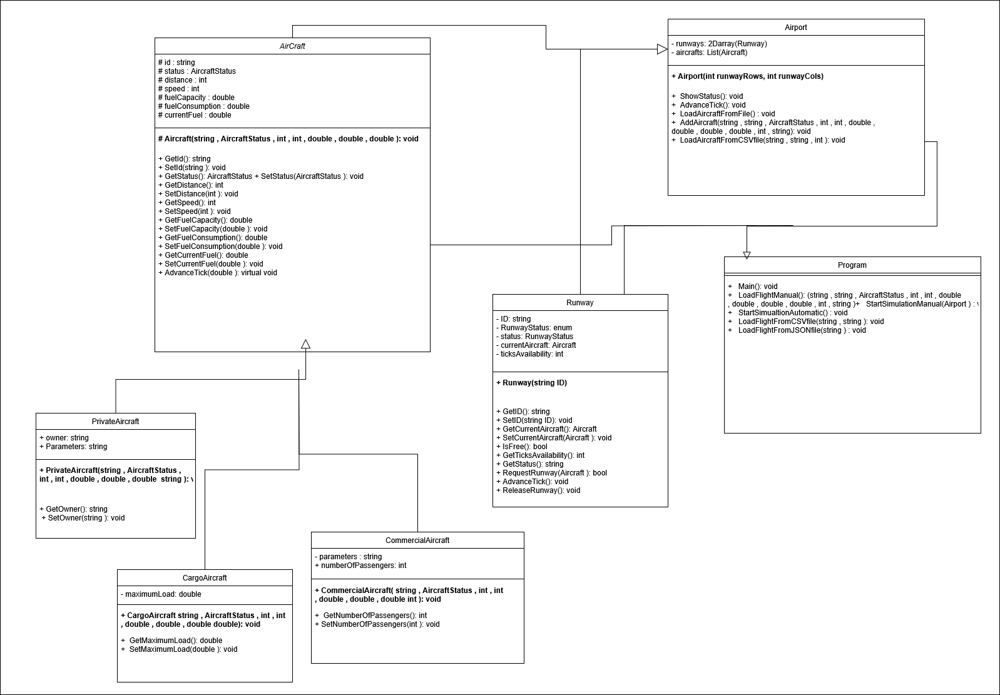

**Statistical Learning and Data Mining**					

**UNIVERSIDAD FRANCISCO DE VITORIA**

**ESCUELA POLITECNICA SUPERIOR**

**Object Oriented Programming**

**Practical work I**

AIRUFV

Group 11

**

# Table of contents
[Table of contents	2](#_toc196669796)

[1. Introduction	3](#_toc196669797)

[1.1	Group members	3](#_toc196669798)

[1.2	Summary of the document	3](#_toc196669799)

[2. Description	4](#_toc196669800)

[2.1 Overview of proposed solution	4](#_toc196669801)

[2.2 Design decisions	4](#_toc196669802)

[2.3 Development decisions	5](#_toc196669803)

[2.4 Class diagram	5](#_toc196669804)

[3. Problems	6](#_toc196669805)

[3.1 Technical challenges	6](#_toc196669806)

[3.2 Design challenges	6](#_toc196669807)

[4. Conclusions	7](#_toc196669808)

[4.1 Lessons learned	7](#_toc196669809)

[4.2 Effectiveness of the Developed Solution	7](#_toc196669810)

[Bibliography	8](#_toc196669811)

#
# **
# **1. Introduction**
1. ## **Group members**

The members of the group that contributed to the design and implementation of the Airline Simulation System are the following:

Hugo Losada Cabeza

Rubén Tapia Blanco

Andries Cornelis Van Wijk

1. ## **Summary of the document**

This document presents a comprehensive design and implementation overview of the Airline Simulation System developed for Object Oriented Programming. The system is designed to simulate aircraft movements, including operations such as landing, waiting for runways, fuel consumption, and the landing process itself. The purpose of this simulation system is to manage the movement of aircraft within an airport, utilizing different types of aircraft (commercial, private, and cargo) and runways. The document outlines the design decisions, development process, challenges encountered and concludes with insights that will inform future projects. The system is implemented in C# and leverages object-oriented programming principles.
# **2. Description**
## **2.1 Overview of proposed solution** 

The Airline Simulation System provides an efficient way to simulate and manage aircraft movements within an airport. It allows users to:

- Load and manage aircraft data, both manually and from external files (CSV format).
- Simulate the movement of aircraft as they approach the airport, land, and occupy or free runways.
- Handle different types of aircraft (commercial, cargo, and private) with specific attributes and behavior.
- Manage runways, assigning them to landing aircraft, and releasing them after a set number of ticks.

The system uses a tick-based approach, with each tick representing a 15-minute interval of time. Aircraft's distances from the airport are reduced as they approach for landing, fuel is consumed based on their distance and fuel consumption rate, and runways are occupied for a predefined period during the landing process.

## **2.2 Design decisions**

Key design decisions include:

1. Class Structure: The system was designed using object-oriented principles, with Aircraft as an abstract base class and CommercialAircraft, CargoAircraft, and PrivateAircraft as subclasses. Each class has specific attributes and methods relevant to the type of aircraft it represents.
1. Aircraft Status Management: The AircraftStatus enum was implemented to track the current state of each aircraft, including InFlight, Waiting, Landing, and OnGround. This allows for clear state management and transition between statuses during the simulation.
1. Runway Management: The Runway class was designed to manage runway availability, with methods for requesting a runway, releasing a runway, and tracking the number of ticks remaining until the runway becomes free. This ensures that runways are managed effectively and can handle aircraft landings in an organized manner.
1. Simulation Flow: The simulation progresses in ticks, where each tick represents a 15-minute interval. Aircraft advance toward the airport, fuel consumption is updated, and runways are managed during the simulation.
1. File Input: The system supports loading aircraft data from CSV files, allowing for easy integration of large datasets. This was implemented using file I/O operations to read and parse CSV data and dynamically create aircraft objects.

## **2.3 Development decisions**

The team decided to divide the work into classes, this meaning the team assigned a specific functionality of the program to each member. Given the fact that we were working with GitHub, this division of tasks facilitated the development of the code, making it easier for everyone to access the changes the rest of the team made. One member was in charge of the Runway class, another was in charge of the Aircraft class and the derived classes and the last was in charge of the Airport class. 

The development of the Program class was a collaborative effort. Since this class serves as the entry point for the application and interacts with all the components (Runway, Aircraft, Airport), the team decided to work together to determine the best way to implement the program’s flow. We discussed how to manage user inputs, implement the main menu system, and trigger the simulation based on user selections (e.g., loading data from a file, manually adding aircraft, and running the simulation in manual or automatic modes). The collaboration ensured that the Program class effectively integrated all parts of the system and allowed for smooth interaction between the user and the simulation.

To maintain code quality and readability, we adhered to coding standards and best practices throughout the development process. This included clear and consistent naming conventions for variables and methods, proper indentation, and the use of comments to explain complex logic. We also ensured that the code was modular and reusable, making it easy to extend the system in the future (e.g., adding new aircraft types, more runway management features, or a graphical user interface).

## **2.4 Class diagram**

# **3. Problems**
## **3.1 Technical challenges** 

One of our problems was that the data from the files was not in the correct format to pass it to the methods to create the aircraft and we wanted to make a futureproof solution in case there is new data to look for, we have search for solutions but found none. So, we manually bind the parameters from the data into separate variables and put the variables for passing into the aircraft creation method.

One more problem we found was using enums, as the lack of practice in this area made us struggle to manage status transitions. Even though they are ideal to represent predefined states and managing frequent status updates.

# **4. Conclusions**
## **4.1 Lessons learned**

File Handling: Properly handling file inputs is crucial in a simulation system that may need to load dynamic datasets. We learned that careful validation and parsing techniques are essential to ensure that file data is correctly interpreted and used within the simulation.

OOP Principles: The use of object-oriented programming principles such as inheritance, encapsulation, and polymorphism significantly streamlined the design and implementation process. By modelling aircraft and runways as objects, we were able to effectively manage system behaviour and ensure extensibility.

## **4.2 Effectiveness of the Developed Solution**

The solution proved effective in simulating a real-world airport scenario. The tick-based simulation allowed for realistic time progression, and the ability to manage multiple aircraft types and runways ensured flexibility in the system. The ability to load data from files and manually add aircraft further enhanced the usability of the system.
##

11

Practical Work II		
